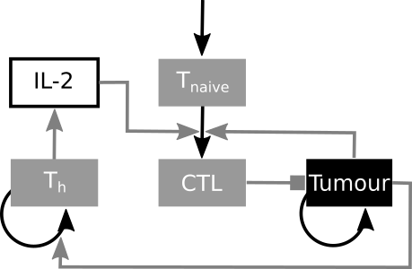
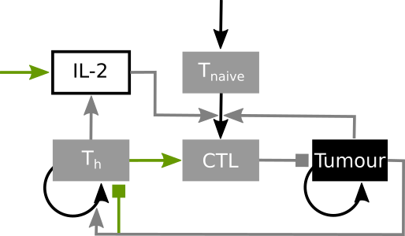

# TME modelling project 1

In this mathematical modelling project, you will start with a small model depicting specific interactions in the Tumour Microenvironment (TME). You will formulate the equations that govern this model and solve them in python. You will then attempt to find a steady state, investigate what happens if we change certain nodes and edges of the network, and think on possible biological meanings of what you observe.

In this project, you will model tumour attack by cytotoxic T lymphocytes (CTL) cells, and investigate how this is regulated by T helpers (Th) cells and Interleukin-2 (IL-2). 

Legend: 
- grey box: Immune cell
- black box: Tumour
- white box: signalling molecule
- black arrow: change in outgoing and incoming species, mostly cell-cell interactions (birth/death/differentation)
- grey arrow: no change in outgoing or incoming species, mostly cell-signalling molecule interactions (secretion/uptake)
- Arrows without either an outgoing or incoming species are entering or exiting the system.
- Each species has a death/outflux term that is not drawn here for simplicity.

## Hints to start designing your own network
- Copy the network onto paper and add all outflows and parameters.
- Cytokine uptake is goverened by a [Hill equation](https://en.wikipedia.org/wiki/Hill_equation_(biochemistry)): 
$`h(C)=\frac{C^h}{C^h+k_{C}^h}`$
- Solid tumours have a core that might be unavailable to the tumour, and so we model it using an accessible tumour area $T^\*$:
$T^\* = \frac{T}{(1+(\frac{T^{1-n}}{k_1})^p)^{1/p}}$. Due to nutrient deficiency in the core after they have reached a certain size, we model tumour growth using a combination of exponential and power law growth. Immune attack can only occur in the accessible tumour area $T^\*$. Thus, we model tumour growth with an equation adapted from Robertson-Tessi et al (2012): 
$\dot{T}=\frac{T}{((\frac{1}{\gamma_{1}})^p+(\frac{T^{1-m}}{\gamma})^p)^{1/p}} - \frac{r_0T^\*}{-(1+k_2\frac{T^\*}{E_a})}$. The parameters have the following value (ranges) and meanings:

| **Parameter** | **Value**     | **Units**                     | **Meaning**                                 |
|---------------|---------------|-------------------------------|---------------------------------------------|
| $\gamma_1$    | 0.1-1         | $day^{-1}$                    | growth coefficient tumour exponential phase |
| $\gamma$      | 100-1000      | $cell^{1-m}day^{-1}$          | growth coefficient tumour power law phase   |
| $m$           | $\frac{1}{2}$ | -                             | growth exponent                             |
| $p$           | 3             | -                             | transition smoothing coefficient            |
| $r_0$         | 0.9           | $day^{-1}$                    | tumour lysis by T cells factor              |
| $k_1$         | 100           | $cell^{1-n}$                  | acessible tumour area factor                |
| $n$           | $\frac{2}{3}$ | -                             | acessible tumour area factor                |
| $k_2$         | 1.2           | -                             | tumour lysis by T cells curve constant      |

- Keep in mind that it is actually tumour antigen that stimulates the differentiation of immune cells, and thus we also model it via a Hill equation: $h(T^\*)$

## Possible extentions to the network:
Once you have the network up and running, you can start exploring modifications. Some possible modifications are depicted below with the green arrows.

## Example network
The network implemented here is a motif by Hart et al. (2012), figure 4:
, figure 4")
From the paper:
"A circuit that produces a robust amount of differentiated cells by endocytosis of a cytokine by the precursor cells. (A) Schematic of a circuit in which cytokine c enhances the differentiation of X1 cells from precursor cells X0. The precursors also remove c by endocytosis. (B) An example of the circuit in differentiation of T-helper cells: CD4+ cells differentiation to T-helper cells (e.g., Th2 cells) is enhanced by IL-2. However, Treg cell level is roughly proportional to the CD4+ pool (5–10% of CD4+ levels; proportionality is marked as a dotted arrow). Tregs take up IL-2, thus reducing its levels. (C) Dynamics of X1 cell concentration reach a homeostatic steady state that is independent of the levels of precursors X0. Different lines represent different X0 levels (contrast with Fig. 1C). Here, α = β0 =1,β3 =3,α1 =2,f(c)=c /c +3,X1(0) = 1, and c(0) = 10.
"

## Schedule
### Monday
Aim: understand the example network and code and your own network.
#### Getting started
- Log in to Pycharm and Gitlab.
- Fork project.
- Set-up virtual environment.
#### Steps
- Look at the example model and equations.
- Understand and play with the code.
- Look at and ask any questions about your own network.

### Tuesday
Aim: Write your own equations and implement the network.
#### Steps
- Start writing your own equations.
- Think about suitable parameters and initial conditions.
- Implement this model.
- Visualise and analyse it.
    - What is its short- and long-term behaviour?
    - Can you find a steady state?
    - What added value does each node have?
    - How strongly to the parameters influence the behaviour?
### Wednesday
Aim: Think about, implement and test your model extension/modification(s). Extend on your model from yesterday, or modify it. 
#### Steps
- See Tuesday.
- Compare the versions you made.

### Thursday
Aim: Investigate and compare your models further, close your project and prepare the presentation. 
#### Steps
- See Tuesday, Wednesday
- Which simulations/visualisations do you need to show the key differences between the models?
- Clean and comment your code.
- Prepare the presentation
### Friday
Present final presentation

## Contents of the final presentation
This can be a notebook presentation if you prefer, but don’t forget to spend time on the biological motivation and insights.
1. Biological motivation
2. Two model variations. Present both a graph and the equations, and take us through it.
3. Steady State analysis of the models.
4. Perturbation analysis.
5. Biological insights or explanations based on 3. and 4. 
6. Conclusion

# References
[1] Robertson-Tessi, M., El-Kareh, A., & Goriely, A. (2012). A mathematical model of tumor–immune interactions. Journal of Theoretical Biology, 294, 56–73. https://doi.org/10.1016/j.jtbi.2011.10.027

[2] Hart, Y., Antebi, Y. E., Mayo, A. E., Friedman, N., & Alon, U. (2012). Design principles of cell circuits with paradoxical components. Proceedings of the National Academy of Sciences of the United States of America, 109(21), 8346. https://doi.org/10.1073/pnas.1117475109
